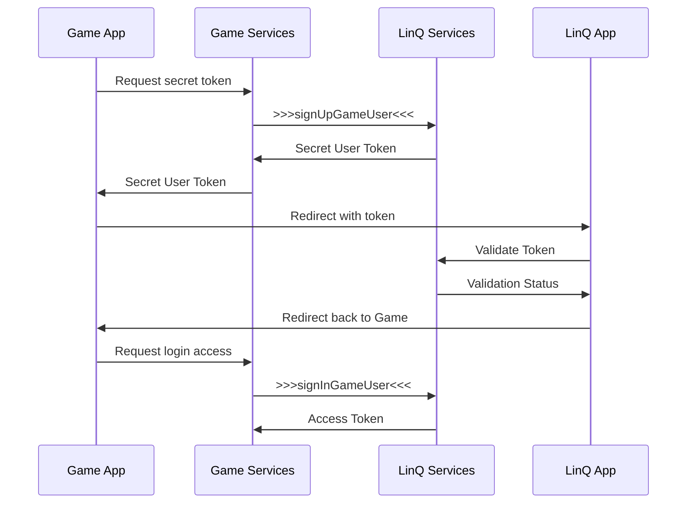

# 📌 All content template

# Introduction

This documentation describes the integration process with LinQ services, as well as the login mechanism through the special LinQ application. Logging in through the LinQ app allows users to authenticate and gives access to all cash flow related features. This is necessary to improve usability and security. However, basic functions are available without authorization through the application.

## Features

Integration through the application includes the following modules:

* [Authentication](modules/auth "Registration and authorization in services")
* [Location Checks](modules/location-checks.md "Check the location by IP address and more precise way using coordinates")
* [Money Operations](modules/money "All cash related operations, including transfers and custom rewards")
* [Play Mechanics](modules/play "Playing related actions, like tournaments starting and players joining")

For integration, the gRPC procedure call protocol is used together with Protocol Buffers.

To connect to services, you must use generated client libraries, which are issued according to agreements.

Technical details of connecting to LinQ services are described on the page [Getting Started](./getting-started.mdx)

### Ways of use

In both cases of using the API, the user in the LinQ system creates his own payment account, and an internal account is created for it in the internal currency associated with the game. Deposit and transfer transactions operate on the balances in these internal accounts.

#### Anonymous (conditional)

In the case of an anonymous account, an account is created in the same way as for a regular account, with the exception that transfers to a wallet account or other games are not available. Also, in the case of an anonymous account, there are restrictions on the maximum amount of funds stored on accounts.

#### Authorized

After the user is authorized through the application, all operations occur on behalf of the user account registered in LinQ services. This allows you to have full access to all the features provided by LinQ services. In particular, go through KYC, withdraw the money you win to your wallet and then to a bank account or card, or use it in other games.

### Check location

Location verification is required to satisfy the requirements of the local government where the business is conducted regarding available operations and overall ability to use services. For example, there are restrictions on financial transactions in territories included in the sanctions lists. There may also be restrictions in certain territories for certain operations or applications where additional licensing is required and has not yet been issued.

A ban by IP restricts the use of the application as a whole from the region, a ban by coordinates prohibits individual operations, but in general allows you to use the application in demo mode or for free games.

### Financial operations

After integrating the solution, the user will have access to the following options:

* top up your internal game account using a card or Apple Pay
* transfer funds from your wallet account to your game account
* use money from your account to participate in a tournament (or other in-game purchases)
* withdraw money to your wallet for subsequent payment to an account or card


import Tabs from '@theme/Tabs';
import TabItem from '@theme/TabItem';

# Getting Started

:::warning
The full implementation and description of the API Reference is still in progress and requires some work on our part, but there are no plans to change the method signatures.
:::

## Access to services

Production and stage environments are available for connection; to start integration, you should use the data for stage.

To gain access to the environment, a special token is required, which is generated upon request. It is used for the initial connection between services, then authorization occurs through user tokens.

<Tabs>
  <TabItem value="stage" label="Stage" default>
    ```
      services-stage-mx6hvkth4a-uc.a.run.app
      services.stage.galactica.games
    ```
  </TabItem>
  <TabItem value="Production" label="Production" default>
    ```
      services.galactica.games
    ```
  </TabItem>
</Tabs>


## Install dependencies

This tutorial provides integration examples for NodeJS and TypeScript.

To get started, install the [@protobuf-ts/grpc-transport](https://www.npmjs.com/package/@protobuf-ts/grpc-transport) and [@grpc/grpc-js](https://www.npmjs.com/package/@grpc/grpc-js)

```bash
# Install via NPM
npm install --save @grpc/grpc-js
npm install --save @protobuf-ts/grpc-transport
```

#### Transport and authorization

To work with gRPC, you need to create two auxiliary functions to create a container for sending commands to a remote service and for authorization. Optional, but improves usability.

```typescript
import { GrpcTransport } from "@protobuf-ts/grpc-transport";
import { RpcOptions } from "@protobuf-ts/runtime-rpc";
import { ChannelCredentials } from "@grpc/grpc-js";

export const getTransport = (): GrpcTransport => {
  const host = process.env.SERVICES_API_URL ?? "";
  return new GrpcTransport({
    host,
    channelCredentials: host.includes('localhost')
      ? ChannelCredentials.createInsecure()
      : ChannelCredentials.createSsl(),
  });
};

export const getAuthorization = (accessToken: string): RpcOptions => {
  return {
    meta: {
      authorization: `Bearer ${accessToken}`
    }
  };
};
```


:::info
Please note that this example uses the `SERVICES_API_URL` environment variable. If your name for this variable is different, you need to edit the example code to suit your needs.
:::

## First request

As a test initial request, you can use a request to the location service by IP address. It does not require authorization.

To begin with, you should download the generated client for this service, unpack it and copy it to the `src/services` folder.

// link to file that can be downloaded
Client for location service

Below is an example of using a client to call the necessary methods on the service, in this case to obtain information about the current location and a flag that indicates whether access is allowed or not.

```typescript
// Import response type
import { Access } from "./services/system/v1alpha1/restrictions";
// Import service client for connecting to the backend
import { RestrictionsServiceClient } from "./services/system/v1alpha1/restrictions.client";
// Import special helpers for building transport and auth
import { getAuthorization, getTransport } from "./utils/transport";

export const accessChecker = async (): Promise<Access> => {
  // creates service instance using transport as a parameter
  const service = new RestrictionsServiceClient(getTransport());
  
  const access = await service.isAccessAllowed({});
  // in case authorization needed, use the next way of doing request
  // auth token - token, which backend gives for user oprations
  // const access = await service.isAccessAllowed({}, getAuthorization('auth token'));

  return access.response;
}

accessChecker().then((access: Access) => {
  console.log(access);
  // will return similar to
  // { allowed: true, location: { country: 'US', region: 'CA', city: 'Palo Alto' } }
});
```


An example application for checking a location is attached below as an archive.

link to file 
src=".gitbook/assets/integration-sdk-example.zip"

# Authentication

## Approach Description

Two modes of working with the API are supported: conditionally anonymous and authorized.

The conditionally anonymous mode gives you the right to create an account in the game currency, top up your account through the game, place bets on tournaments and receive rewards for tournaments. But in this mode, the user cannot withdraw money from the game anywhere. Also, in the case of anonymous mode, there may be restrictions on the maximum amount of money in the account.

The authorized mode removes restrictions and allows you to perform all operations, including transferring money from the game to your wallet (for subsequent withdrawal to a bank account or card). This mode assumes that the user has a full-fledged active account in LinQ services.

To work with the API and organize/restrict access, certain keys and tokens are used. More information about token types can be found on the page [Types of tokens](/modules/auth/tokens).

## Authorization procedure in LinQ services

Step-by-step user registration guide. The examples below are given in TypeScript, but the names of the methods are relevant for any programming language.

### User registration on the app side

Immediately after the user registers in the game or logs in for the first time, it is worth registering him in LinQ app so that he has the opportunity to top up his account.

First, you need to register a request from a third-party service and obtain an Access Token to complete the registration.

To obtain a token, use the [AuthGameService](https://buf.build/linq/linq/docs/main:linq.auth.game.v1#linq.auth.game.v1.AuthGameService) service and the [SignInGame](https://buf.build/linq/linq/docs/main:linq.auth.game.v1#linq.auth.game.v1.AuthGameService.SignInGame).

```typescript
const authGameService = new AuthGameServiceClient(getTransport());

const payload = await authGameService.signInGame({
      gameToken: process.env.GAME_SECRET ?? '', // private secret key
      gameUserId: user.id, // your internal user identifier
});

user.accessToken = payload.response.accessToken;
// save user
```

After this, you can use this token for other requests, for example, to check the user's balance.

```typescript
const accountsService = new AccountsServiceClient(getTransport());

const gamingBalance = await accountsService.getActualBalance(
    { currency: "GMC" },
    getAuthorization(user.accessToken)
);
```

### User authorization on the app side

Login and authorization through the application has several stages and methods of interaction at these stages. The use of each method depends on technical capabilities.

After registering an anonymous account, at the user’s request, you should provide him with the opportunity to log in through LinQ app, thereby linking the game account and wallet.

Usually, after going to the wallet, the user is prompted to create an account there, if he doesn’t already have one, or log into an existing one. Optionally, via the API, you can create a user in LinQ services and invite him to immediately log into the account created for him, bypassing the registration stage.

#### General authorization scheme



#### Authorization request

Before authorization begins, a secret token must be generated for the current user, which will be used to validate the request on the wallet side. To do this, you should use a service and method.

```typescript
const service = new AuthUserServiceClient(getTransport());

const payload = await service.signUpGameUser({}, getAuthorization(user.accessToken));

// should be returned to the App
// payload.response.userToken
```

In this request, you can also transfer user data, thereby creating an account for him in the LinQ services. It is important that in this case, on the game side, before redirecting the user to the LinQ application, you need to warn the user in an obvious and understandable way that an account will be created for him in a third-party application.

```typescript
const service = new AuthUserServiceClient(getTransport());

const payload = await service.signUpGameUser({
    dob: "",
    phone: "+375291234567",
    email: "u1@sendmail.co"
    first_name: "Fist"
    last_name: "Last"
}, getAuthorization(user.accessToken));

// payload.response.userToken
```

Not necessarily, but it is recommended to additionally request his permission for this by adding a checkbox with a similar question or in the form of a separate pop-up window with the same question.

#### User request validation


##### With LinQ App

The received token should be added to a deep link, which will open the LinQ application, where the user can log in to his account and confirm the request from the game. Thus, the game account will be linked to the wallet account. If the LinQ application is not installed, the user should be sent to the App Store for installation.

```
var linqUrlTemplate = 'linq-stg://?user_token={0}';
```


<!--  -->
```
var linqUrlTemplate = 'linq://?user_token={0}';
```

```csharp
var sid = "123455678";
var storeLink = sid != "" ? "itms-apps://apps.apple.com/app/id" + sid : "itms-beta:";
var inappLink = string.Format(linqUrl, response.token);

Application.OpenURL(IOSCanOpenURL.CheckUrl(inappLink) ? inappLink : storeLink);
```

Or you can use Associated domain that opens app if installed and redirects to App store (or Testflight for staging) if not installed

```
https://a.stg.linq.gg?user_token={token} // stage
https://a.linq.gg?user_token={token} // prod
```

There is also a method of transferring tokens through Keychain, which is used in cases where the LinQ application is not yet installed on the user’s device. More information about this method on the page [keychain.md](/modules/autherntication/keychain.md "mention").

##### With LinQ Web

Redirect to web login page to verify received token. It can opened either through webview or in separate browser window.

```
https://s.stage.linq.gg/verify_token?token=${userToken} // Staging
```

```
https://s.linq.gg/verify_token?token=${userToken} // Production
```

If use webview you can close it and proceed after page will be redirected to `/verify_success` path. All errors will redirect to `/error`.

#### Authorization and obtaining an access token

After confirming the request from the game in the LinQ application, the user will be returned back to the game. Next, on the game side, you should authorize the user in the LinQ services using his current access token and secret code. In response to the request, an `access_token` and `wallet_id` will be returned, which should be saved to the user profile on the game side.

```typescript
const service = new AuthUserServiceClient(getTransport());

const data = {
    userToken: "token-value" // value that returned on token request
};

const payload = await service.signInGameUser(data, getAuthorization(authToken));

// payload.response.accessToken
// payload.response.id
```

## Save game user data to anonymous profile to avoid deposit limits

To avoid [deposit limits](/modules/money#anonymous-profiles) you need to provide user's game account info using [SaveGameUser](https://buf.build/linq/linq/docs/main:linq.auth.user.v1#linq.auth.user.v1.AuthUserService.SaveGameUser)

```typescript
const service = new AuthUserServiceClient(getTransport());

const payload = await service.saveGameUser({
    user: {
        dob: <date_of_birth>,
        phone: "+11111111",
        email: "test@test.com"
        first_name: "Fname"
        last_name: "Lname"
    }
}, getAuthorization(user.accessToken));
```


# Types of tokens

Four types of tokens exist and are used to provide access. Two of them are directly responsible for access, the other two are auxiliary.

## Access tokens

They are used to validate user requests and, based on them, access to certain service functions is provided.

### Access Token

This token is created upon request from a third-party service and is then used to sign user transactions in LinQ Wallet services. Works in conditional anonymity mode. The token should be saved to the user profile for subsequent operations. The token's lifetime is unlimited.

### Wallet Token

This token is issued after authorization through the LinQ application. Works similar to _Access Token_, but provides more rights. The token's lifetime is also unlimited. The token must be stored in the user profile.

After authorization, _Access Token_ can be replaced with _Wallet Token_, or you can store both, but use _Wallet Token_ first when authorizing.

The method of saving two tokens is used in one of the games. An example of using such a pair of tokens when creating an authorization header:

```typescript
getAuthorization(user.walletToken ?? user.accessToken);
```

## Auxiliary tokens

Auxiliary tokens are needed to ensure the technical implementation of the exchange of sensitive information between applications or services.

### Secret Keys

#### Private

The private secret key is issued before the integration begins and is used to verify requests coming from a third-party service. In response to a request with such a key, a user access token is returned, which can be used to sign the user's transactions.

It is recommended to pass it to the application as an environment variable, while ensuring that the code is not leaked. For example, use Google Secret Manager or similar services. The principle of operation is almost the same as that of any Secret Key.

#### Public

The public secret key is issued before the integration begins and is used to initialize LinQ SDKs(Unity) and in general verify requests coming from front-end.

### Secret Token

This token is required to initiate login through LinQ app from the application or game side. This token is involved in the formation of a special secret code, which is verified in the LinQ application, and based on this code, the accounts are finally linked.


# Storing tokens in Keychain

During the integration process, you need to link the game and the LinQ application, this is done through the exchange of tokens and redirection to the LinQ application to confirm the link of accounts. However, this method will not work if the user does not yet have the LinQ application installed.

For such cases, you should use saving the access token in a special storage [Keychain](https://developer.apple.com/documentation/security/keychain\_services). Then, after redirecting the player to the Apple Store and installing the LinQ application, the LinQ application will be able to obtain this token from the storage and make a request to authorize the game.

After verifying the token and confirming their intention to link accounts, the user will be redirected back to the game, where they will need to complete [user login request](/modules/auth#authorization-and-obtaining-an-access-token) with a previously received token.

## Limitations when working with Keychain

There are two main restrictions: this mechanism only works in the Apple ecosystem and this mechanism only works when applications have one common account in the Apple Store. Thus, this integration can only be implemented after the game is transferred to the Galactica Games account.

There is no such solution for the Android version yet, but it may be available in the near future.

## Implementation example

To work with Keychain in Unity, you can use the plugin [iOS Keychain Plugin](https://assetstore.unity.com/packages/3d/characters/ios-keychain-plugin-43083), but not necessarily, there may be better solutions.

<!-- In the Solitaire Coin game, the moment you click on the "Sign In with LinQ" button before redirecting the user to LinQ (if installed) or to the AppStore (if not installed), the `user_token` received from the API is stored in the storage. -->

You need to set iOS Keychain [`accessGroup`](https://developer.apple.com/documentation/security/ksecattraccessgroup) and configure [Keychain Sharing capability](https://developer.apple.com/documentation/xcode/configuring-keychain-sharing) to [save the token to keychain](https://developer.apple.com/documentation/security/keychain_services/keychain_items/sharing_access_to_keychain_items_among_a_collection_of_apps) in the right way.

Access groups:
```
$(teamID).games.galactica.linq.stg.shared // stg
$(teamID).games.galactica.linq.shared // prod
```

(Pay attention that all access groups configurations should be set up without $(teamID) prefix, it's added automatically when the app published from Galactica Games account)


```csharp
API.GetLinqUserToken(response =>
{
  #if UNITY_IOS
    Keychain.SetValue("GAME_LOGIN_TO_GALACTICA_WALLET_TOKEN", response.token);
  #endif
}, error =>
{
  // handle error
}
```

Next, you should implement processing of the situation when the user returns to the game and make a request to confirm the account link.

<!-- ## LinQ app token verification

This type of integration is _**not required**_, but it is possible. The LinQ application has the ability to check which of the registered games are installed on the user's phone and when entering the LinQ application, it offers to authorize this game, similar to the situation when the user was redirected from the game to the wallet.&#x20;

In this case, the LinQ application, for its part, generates `user_token` and, when confirmed by the user, authorizes this request, and places the token in the Keychain storage. On the game side, you should contact the Keychain storage and if there is a token there, then make a request to confirm the link of accounts.

```csharp
#if UNITY_IOS

  var token = Keychain.GetValue(TOKEN_MAP_KEY);

  API.AuthSignIn(token, OnSingInSuccess, OnSingInError);

#endif
``` -->

# Money Operations

The LinQ system provides for the creation of an account for the user with the desired currency code, where funds are credited during the process of replenishment, transfer, or winning in a tournament.

The API provides three services for interaction. The first concerns the management of the game account, the second is needed to replenish the balance and transfer funds to the wallet for subsequent withdrawal, the third allows you to obtain a list of all transactions on the user account, which can be convenient for reconciling calculations.

## Account Management

To manage the account, the [AccountsService](https://buf.build/linq/linq/docs/main:linq.money.accounts.v1#linq.money.accounts.v1.AccountsService) service is used. It allows you to receive the current state of the user’s account, as well as carry out operations that are needed during the game: take the amount to bet in the tournament and credit the winnings after the end of the tournament.

### View your balance

Within a wallet, a user can have several gaming accounts and a basic wallet account. Each account has its own code, analogous to the real currency code. When working with the API, you can only get the account balance for the current game and the wallet account balance. For security reasons, balances for other games are not available.

```typescript
const accountsService = new AccountsServiceClient(getTransport());

const walletBalance = await accountsService.getActualBalance({ currency: "LNQ" }, getAuthorization(authToken));
const gamingBalance = await accountsService.getActualBalance({ currency: "GSC" }, getAuthorization(authToken));

// gamingBalance.response.balance;
// walletBalance.response.balance;
```

To avoid latency it is possible to request all balances in one request, but than you have to filter response on your side to match balances and currency in code of the game.

```typescript
const accountsService = new AccountsServiceClient(getTransport());

const accounts = await accountsService.getAllAccounts({}, getAuthorization(authToken));

const walletBalance = accounts.response.accounts.filter((v) => v.currency == "LNQ").pop()?.balance || 0;
const gamingBalance = accounts.response.accounts.filter((v) => v.currency == "GSC").pop()?.balance || 0;
```

### Withdrawal of funds

Withdrawal of funds from the account is carried out using a separate method, but in fact this operation generates an order, which is subsequently available in the transaction history.

```
// Some code
```

### Depositing funds

Similar to the process of withdrawing funds, funds are also credited to a specific user account.

```
// Some code
```

## Payment Transactions

When working with payments, the API operates with the concept of Order. The order stores information in general about the user's intent and the order goes through processing stages where additional technical information is added to it. The order works similarly to orders in e-commerce, but taking into account the specifics of the game. The [PaymentsService](https://buf.build/linq/linq/docs/main:linq.money.payments.v1#linq.money.payments.v1.PaymentsService) service is responsible for the formation and processing of orders.

### Replenishment with checkout page

To replenish money, you need to create a replenishment order, where you need to indicate the amount to replenish, to which internal account the amount should be credited (usually the game account) and additional parameters for subsequent tracking of the order, if required.

```typescript
const payload = await service.newReplenishOrder(
  {
    asset: 'GSC',
    amount: input.amount, // amount in coins
    reference: 'any', // any kind of internal reference
  },
  getAuthorization(user.walletToken ?? user.accessToken),
);

// payload.response.checkout - link to checkout page
```

### Native Payments

We provide an ability to integrate native payments in the game using special [Unity SDK](https://github.com/linqgg/unity-sdk), which is handle all operations with user sensitive payment data (like card number, cvv and others) on the client side. Such an approach makes the process much easier and PCI DSS compliant at the same time.

#### Native Payment Card

To implement native payments via debit or credit cards, you have to implement UI elements for capturing payment data, like **card number**, **protection code**, **cardholder name**, and **expiration date**, as well as elements for capturing player **billing address**. To be compliant with PCI standards, you have to avoid sending captured data to any of your backend services except providing payment details to the specified SDK methods.

We use certified third-party services for card tokenization in combination with anti-fraud checks, and we do not handle raw user payment information as well.

Before start integrating, you have to [install](https://github.com/linqgg/unity-sdk?tab=readme-ov-file#installation) and [configure](https://github.com/linqgg/unity-sdk?tab=readme-ov-file#setup) our Unity SDK.

If you integrated LinQ services before, the flow will remain almost the same. You have to generate a replenishment order by `newReplenishOrder` from Server SDK, and proceed with Unity SDK using the returned `order.id`.

```scharp
// Card Details
var details = new PaymentDetails()
{
  CardNumber = "4242424242424242",
  Expiration = "12/27",
  HolderName = "Kevon Chang",
  Protection = "123",
};

// Billing Address
var address = new BillingAddress()
{
  Country = "US", // 2-letter code
  Region = "Iowa",
  City = "Iowa City",
  Street = "109 S Johnson St",
  Zip = "52240"
};

try {
  var response = await LinqSDK.CheckoutByOrdinaryCard(order, details, address);
  Debug.Log("Order status: " + response.Status);
} catch (InvalidOperationException e) {
  Debug.Log("Failure: " + e.Message);
}
```

For testing purposes, you can use the following card credentials:

- Number: `4242 4242 4242 4242`
- Expriration: `12/27`
- Holder Name: `CARD HOLDER`
- CVV Code: `123`

In some cases, native modules, that are used under the hood, may not work. It is applied for situations when the game is running on Android or from Unity Editor. To not block the flow it is possible to skip anti-fraud checks by providing the word `NOFRAUD` in the field of the cardholder name.

#### Native Apple Pay

Apple Pay method does not require a billing address or card details, as it comes from the user's wallet. Additionally, need to handle some exceptions in case payment fails or is canceled by the user to avoid the application hanging out.

```scharp
try {
  var response = await LinqSDK.CheckoutByApplePayCard(order);
  Debug.Log("Order status: " + response.Status);
} catch (PaymentUnknownException e) {
  Debug.Log("Unknown: " + e.Message); // do nothing
} catch (PaymentFailureException e) {
  Debug.Log("Failure: " + e.Message); // show a message about failed payment
} catch (PaymentDiscardException e) {
  Debug.Log("Discard: " + e.Message); // handle logic about cancellation
}
```

For **Apple Pay** testing, you need to create special testing account and add there the next card details. Authorization may work with any cards and accounts, but transactions will fail on the provider side.

- Number: `5204 2452 5000 1488`
- Expriration: `11/2022`
- CVV Code: `111`

To get updated with the lates usage examples, please check relevant documentation section about [Unity SDK usage](https://github.com/linqgg/unity-sdk?tab=readme-ov-file#usage).

### Brazil Pix payment
To make the payment Pix code should be generated and displayed to the user.

To generate Pix code user's full name and email are required. They should be passed to us with help of [AuthUserService#SaveGameUser](https://buf.build/linq/linq/docs/main:linq.auth.user.v1#linq.auth.user.v1.AuthUserService.SaveGameUser) method. If the data won't be passed [NativePaymentsService#GetPixPaymentData](https://buf.build/linq/linq/docs/main:linq.money.payments.v1#linq.money.payments.v1.NativePaymentsService.GetPixPaymentData) request will be failed.

First order should be initialized with `newReplenishOrder` called from the server.

Then call [NativePaymentsService#GetPixPaymentData](https://buf.build/linq/linq/docs/main:linq.money.payments.v1#linq.money.payments.v1.NativePaymentsService.GetPixPaymentData) (authenticated by [Public token](/modules/auth/tokens#public)). It accepts optional [params](https://buf.build/linq/linq/docs/main:linq.money.payments.v1#linq.money.payments.v1.PixPaymentRequest) tax_id and address. Tax id is Brazilian CPF number (ask if validation rules are required). Address - country is 2-letter code of Brazil (BR), region is 2-letter code of Brazilian state (ask if list of states with their full names are required).

After displaying Pix code to user wait for the some time and use [getOrderStatus](/modules/money#order-status) to determine if order status changed and if it succeed or not.


### Order Status

After creating a replenishment order, a link will be returned in response, which must be displayed inside the game using webview. After payment (successful or not), control will be returned back to the application, after which you should make sure what the status of the order is. It can be successfully paid or rejected by the payment system.

```typescript
const service = new PaymentsServiceClient(getTransport());

const payload = await service.getOrderStatus(
  { id: input.order },
  getAuthorization(user.walletToken ?? user.accessToken),
);

if (payload.response.status === 'completed') {
  // apply internal operation
}
```

#### Passing data from webview

In the case of [UniWebView](https://uniwebview.com/) integration, the transfer of control from the webview back to Unity occurs through the generation of a special link where the user is redirected and the module intercepts them, returning control.

First, you need to create a browser window object and open the payment link you received earlier.

```csharp
browser = new GameObject("UniWebView").AddComponent<UniWebView>();
// ... other init params
browser.Load(url);
browser.Show();
```

Then you need to add an event handler that will fire when the page loads and indicate that UniWebView is being used, the code on the page will rely on this fact and send a response after the payment transaction is completed.

```csharp
browser.OnPageFinished += (view, statusCode, url) => {
    browser.AddUrlScheme("http");
    browser.AddUrlScheme("https");
    browser.EvaluateJavaScript("window.uniwebview = true;", (payload) => {
        if (payload.resultCode.Equals("0")) {
            Debug.Log("UniWebView registered!");
        } else {
            Debug.Log("Something goes wrong: " + payload.data);
        }
    });
};
```

Next, you need to add a handler that will monitor the state of the current window and accept responses from the page inside.

```csharp
browser.OnMessageReceived += (view, message) => {
    if (message.Path.Equals("completion")) {
        var success = bool.TryParse(message.Args["success"], out var parsedValue) && parsedValue;
        if (success) {
            onSuccess?.Invoke();
            Close();
            return;
        }
        onError?.Invoke();
        Close();
        return;
    };
};
```

Here are basic examples, the full class listing is available in the file below.

here files listing missed

### Transfer

To transfer money to a wallet, similar to replenishment, you need to create a transfer order.

```typescript
const service = new PaymentsServiceClient(getTransport());

const payload = await service.newTransferOrder(
  {
    amount: input.amount,
    fromAsset: operation == Operations.depositing ? "LNQ" : "GSC",
    toAsset: operation == Operations.depositing ? "GSC" : "LNQ",
    idempotencyKey: 'any'
  },
  getAuthorization(user.walletToken),
);
```

## Operations history

To obtain the history of operations (or transactions), you should use the [OperationsService](https://buf.build/linq/linq/docs/main:linq.money.operations.v1#linq.money.operations.v1.OperationsService) service.

This service provides a list of all orders that were created by the user, allowing them to be used for analysis or display to the user, depending on the needs.

At the time of forming the request, it is possible to filter the data by type of operation (replenishment, rate, reward, etc.) and by status (completed, awaiting payment, etc.). In addition, you can set a time frame for what period you want to obtain data. The default is to return all operations.

## Limits

To check if any money operation limit reached use [IsLimitReached](https://buf.build/linq/linq/docs/main:linq.money.payments.v1#linq.money.payments.v1.PaymentsService.IsLimitReached)

### Existing limits

#### Anonymous profiles

Current total deposit amount for anonymous profiles is limited to **20.00**.
To overcome it please [sign in user with LinQ wallet](/modules/auth#authorization-request) or [provide user's game account data](/modules/auth#save-game-user-data-to-anonymous-profile-to-avoid-deposit-limits)


# Migrating to V2 🏷️

## Overview

This short tutorial describes how to best migrate existing money requests to the new [Play API](/modules/play).

## AccountsService v2

To address previous issues and improve system design, we are introducing a new version of the AccountsService, which reduces direct operations with accounts to enhance safety. Instead, we recommend managing transactions related to tournaments through the [Play API](/modules/play).

[The second version of the service](https://buf.build/linq/linq/docs/main:linq.money.accounts.v2) introduces a new method, `GetActualBalances`, which returns the balances for both the current game account and the linked LinQ/PlayPal account, if available. The balance information includes two types: `current` and `available`. Currently, both values are the same, but in the future, `available` will represent the money that can be spent, while current will reflect the actual state of the account.

Additionally, the new version provides a method called `ApplyCustomReward`. This method, which can be enabled upon request, allows for sending special custom rewards directly to a user's account. This is useful for awarding users with real money. The `ApplyCustomReward` method is turned off by default and can be activated as needed.

## Migrating to Play API

New Play API introduces special entity like `Session`, which has to be linked with every tournament. Also, in this session we attach players and do all needed transactions for them on our side, providing results of such operations.

To migrate, first of all, need link tournaments with remote session, using special service [`SessionsService`](/modules/play#sessionsservice) and use its methods for managing remote sessions.

### How to replace `getMoney`

In the initial version, you directly debited money from the user's account using the `getMoney` method. This approach is now deprecated. Instead, we recommend using the `Join` method of the `PlayersService`. This method attaches the player to the appropriate session, performing all necessary integrity checks on our side. As a result, it returns information about the created order, which will also appear in the transaction history. **Note that if a player joins using only bonuses, no order will be created.**

Example of the returned `Order`:

```protobuf
message AppliedPlayerOrder {
  // Order identifier, uuid string
  string id = 1;
  // Type of the order, bet, stake or any other
  string type = 2;
  // Amount of the order for bet or win
  uint32 amount = 3;
  // Order status after transaction has beed applied
  string status = 4;
  // Reference data that was placed into the order during the creation
  string reference = 5;
}
```

### How to replace `putMoney`

Similar to `getMoney`, the `putMoney` method is now deprecated. To award prizes to players, you first need to complete the current session by providing the tournament table with all required data. Based on this information, the system generates all necessary orders and returns them within the response to the `SessionsService.Complete` method call.

Example of `Position` message description:

```protobuf
message Position {
  // Remote player ID returned on Join request
  string player = 1;
  // Place taken by the player
  int32 place = 2;
  // Prize that has to be paid to the player
  int32 prize = 3;
  // Score earned by the player
  optional int32 score = 4;
  // Duration spend by the player, in seconds
  optional int32 duration = 5;
  // Reference data that was placed into the order during the creation
  // Will be applied only when spread is true
  optional string reference = 6;
  // Timestamp when the player exited the game
  optional google.protobuf.Timestamp exited_at = 7;
}
```

Optionally, you can complete a session in two ways:

- **Without Generating Orders**: This option performs all necessary checks but does not generate orders, meaning no real money transactions are created during the call.
- **With Order Generation**: By defining the parameter `spread`, all transactions will be created during the API call, resulting in real money transactions being processed.

```protobuf
message CompleteSessionRequest {
  // Marks that tournament after finishin has to spread money automatically
  // based on the leaderboard table
  optional bool spread = 3;
}
```

#### Handling Rewards

If auto-spreading is not applied, you need to provide the user with the ability [to claim their reward](/modules/play#player-gains-reward). This ensures that users can manually collect their earnings from the tournament.


# Location Checks

Location verification is required to comply with regulatory requirements regarding financial transactions that the user carries out while using the application.

LinQ services use two types of user location verification, differing in more precise location determination and nature of operations.

Checking the user's location by IP address is carried out in order to limit access to services from regions that are subject to restrictions by the jurisdiction where business is conducted.

Checking the location using the user's coordinates is carried out to ensure the legality of operations in a given territory; as a rule, this applies to operations related to the movement of funds (deposits, withdrawals, placing a bet to participate in a tournament).

## IP verification

To check access over IP, the `RestrictionsService` service is used, which provides the `isAccessAllowed` method

<!-- ### List of countries and regions where transactions are restricted

In some cases, you may need to check access from a certain region through third-party services, in which case you can use the [ConfigurationService](https://buf.build/linq/linq/docs/main:linq.geo.restrictions.v1#linq.service.geo.restrictions.v1.ConfigurationService) to obtain an up-to-date list of countries and regions where restrictions on operations have been introduced.

This service requires authorization through a special game token ([Secret Key](https://galactica-games.gitbook.io/integration-sdk/sections/registraciya-i-avtorizaciya/vidy-tokenov#secret-key)), so as not disclose this information publicly. This is also necessary for the case when there are stricter restrictions for a particular game than for the platform as a whole.

For example, card games require an additional license in the state of Maine, so a request from Solitaire services will include that state as a prohibited state, while other applications will not.

```typescript
const service = new ConfigurationServiceClient(getTransport());

const payload = await service.getAvoidedRegions({
  token: process.env.GAME_SECRET_KEY ?? '',
});

/**
{
  "countries": [ "AF", "MK", "AL", "XK" ],
  "areas": [
    { "country": "US", "regions": [ "AZ", "LA", "SC", "DE", "WA" ] }
  ]
}
**/
``` -->

## Check by GEO

To check access to operations based on user coordinates, the LocationService service and the isOperationAllowed method are used.


# Play Mechanics 🏷️

## Overview

The play mechanics for managing tournaments consist of two primary services: `SessionsService` and `PlayersService`. These services facilitate the lifecycle of a tournament, from initiating a session to completing or dissolving it, and managing player interactions within the session.

### Services and Methods

#### [SessionsService](https://buf.build/linq/linq/docs/main:linq.play.sessions.v1)

The `SessionsService` manages the flow of tournaments on the wallet side and provides the following methods:

1. **Initiate** – Starts a new play session, as params receives player stakes.
2. **Complete** – Stops the tournament, including spreading rewards via a special flag.
3. **Dissolve** – Terminates the current session in case it is canceled, and returns the bets.

#### [PlayersService](https://buf.build/linq/linq/docs/main:linq.play.players.v1)

The `PlayersService` manages player interactions within a tournament session and provides the following methods:

1. **Join** – Attaches a player to the session (tournament), including internal checks and automatically takes bets according to the tournament config.
2. **Gain** – Allows a player to gain their reward if the tournament does not have automatic spreading.

The `reference` identifier can be used to check the history of operations, ensuring that all transactions are accurately recorded and can be reviewed for accountability and compliance purposes.

### Authorization for requests

Both services are designed for server-to-server usage, but they differ slightly in their authorization requirements. Requests to the `SessionsService` must be authorized by the game server using a [Private Secret Key](/modules/auth/tokens#private). In contrast, requests to the `PlayersService` must be authorized on behalf of the player using [Access Tokens](/modules/auth/tokens#access-tokens). This distinction ensures that game servers manage session-level operations securely, while player-specific actions are authenticated with tokens that represent the player's identity and permissions.

## Usage Documentation for Developers

### Getting Started

To use the tournament management API, follow these steps:

1. **Initiate a Session**: Use the `SessionsService.Initiate` method to start a new session. Note the sessison `id` returned. Required fieads are: `seats` - amount of players, `prize` - common sum of rewards, `entry` - cost for joining per user. The field `title` is optional, but we highly recommend providing it to simplify the dashboard search later.
2. **Join Players to Session**: Use the `PlayersService.Join` method to attach players to the session using the session `id` and their params, like `username`, `stake` and others. Method will return player `id` and applied order with information about money.
3. **Complete or Dissolve Session**:
    - If the tournament concludes normally, use the `SessionsService.Complete` method to complete the session and distribute rewards.
    - If the tournament is canceled, use the `SessionsService.Dissolve` method to terminate the session and return the bets.
4. **Player Rewards**: If the tournament does not automatically spread rewards, players can claim their rewards using the `PlayersService.Gain` method with their player `id` and the session `id`.

### Example Workflow

#### Initiate a Session

  ```typescript
    const remoteSession = await sessionService.initiate({ 
      title: "High Stakes",
      seats: 5,
      entry: 250, // 2.5$
      prize: 1000, // 10$
    }, getAuthorization(process.env.SECRET_KEY));

    // need to store remote id for later usage
    tournament.remote = remoteSession.id;
  ```

#### Join a Player
  
  ```typescript
    const remotePlayer = await playerService.join({
      session: tournament.remote,
      username: "John Doe",
      stake: {
        value: 200, // 2$ real cash
        bonus: 50,  // 0.5$ bonuses
      }
    }, getAuthorization(user.walletToken || user.accessToken));

    // need to store remote id for later usage
    player.remote = remotePlayer.id;
  ```

#### Complete the Session
  
  ```typescript
    //...
    positions.push(new Position({
      player: player.remote,
      place: player.place, // place taken by player
      prize: player.reward, // reward for player according tournament config
      score: player.score, // score earned by player, optional
      duration: player.duration, // time spent for game by player, optional
    }));
    //...

    const session = await playService.complete({
      session: tournament.remote,
      positions,
    }, getAuthorization(process.env.SECRET_KEY));
  ```

#### Player Gains Reward

  Normally one user as a player can take part only in one tournament. If it will change in the future, it is possible to use optional parameter `player` to define for which exact player under the current user to gain reward.

  ```typescript
    const remotePlayer = await playersSerivce.gain(
      { session: tournament.remote },
      getAuthorization(user.walletToken ?? user.accessToken)
    );
  ```

### Asynchronous Interaction

In cases, when API calls has to be used in asynchronous manner, we provide special field for setting dates. Normally we detect these dates on our side, in time when we handling requests, but you can redefine it. There are some example of such parameters.

```protobuf
message InitiateSessionRequest {
  // Timestamp when the session was initiated
  optional google.protobuf.Timestamp initiated_at = 5;
}
```

```protobuf
message Position {
  // Timestamp when the player exited the game
  optional google.protobuf.Timestamp exited_at = 7;
}
```

```protobuf
message CompleteSessionRequest {
  // Timestamp when the session was completed
  optional google.protobuf.Timestamp completed_at = 5;
}
```

It works the same for `DissolveSessionRequest` as well.

```protobuf
message JoinPlayerRequest {
  // Timestamp when player was joined to the session
  optional google.protobuf.Timestamp joined_at = 5;
}
```

```protobuf
message GainPlayerRequest {
  // Timestamp when player was gained his reward
  optional google.protobuf.Timestamp gained_at = 4;
}
```

### Referencing Orders

In various parts of the public API, the reference field is utilized to tag orders with custom user-defined keys. This functionality enables users to mark and track transactions, which can later be validated against the order history (transaction list). The Play API also supports this feature, allowing you to define the `reference` property for better tracking and validation of all money orders associated with tournament sessions. This ensures that every financial transaction, from bets to rewards, is accurately recorded and easily traceable.

### Idempotency Implementation

While the Play API does not use a specific idempotency property, it still adheres to idempotency principles. If a player attempts to join the same session multiple times, the API will return the same remote ID and associated order as the initial request. This approach ensures that duplicate requests do not result in multiple entries or duplicate transactions. The same idempotent behavior applies when players claim their rewards; repeated requests will yield the same result as the first successful attempt. This ensures consistency and reliability in the management of tournament sessions and rewards.

### Error Handling

Ensure to handle errors appropriately by checking the `status` and error messages in the API responses. For example:

This part will be updated when we add number for errors.

### Conclusion

By following this documentation, developers can efficiently integrate and manage tournament sessions and player interactions using the `SessionsService` and `PlayersService`. For any further assistance, refer to the detailed [API reference](https://buf.build/linq/linq) or contact support.


# Get support

We'd love to stay in touch—here are a few ways to stay up to date.

For feature requests, bugs, or technical questions, email us at [support@galactica.games](mailto:support@galactica.games).

We aim to respond as quickly as possible.